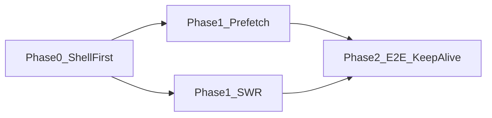

# タブ遷移待ち — 推奨実装方針（WS5）

調査日: 2026-07-01  
入力: [`tab-wait-inventory.md`](./tab-wait-inventory.md), [`tab-wait-timings.md`](./tab-wait-timings.md), Playwright / chunk プローブ

**本調査フェーズでは本番 UX を変更していない。** 以下は実装 PR 分割案。

---

## 調査結論（要約）

| 層 | ゲスト Web | 認証済み Web（静的） |
|----|-----------|---------------------|
| **A Provider** | **主因（部分）** — `/`→他タブで tRPC mount + 全画面 fallback ~445ms | Clerk 初回のみ（以降軽） |
| **B Auth** | ゲストは preview UI へ直行（軽） | 各 tab `isAuthReadyForUI` で全画面 spinner |
| **C Chunk** | 本番キャッシュ後は軽；**prefetch 未登録 route が初回コールドで重い** | post/events/zukan route lazy 未 prefetch |
| **D Data** | tRPC 1–3 本/遷移 | `staleTime: 0` で再訪問 refetch |

**KPI 基準（現状ベースライン・本番ゲスト）**

- `mainContent_ms` 中央値: **602ms**（コールド直リンク）
- `fullSpinner_ms`（/→/events）: **445ms**
- `shellVisibleDuringSpinner`: **true**（サイドナビは出るがメインは空白/spinner）

---

## Phase 0 — Shell First + Guest 非ブロッキング（最優先）

**目的:** 全画面 spinner / 真っ白を解消。`fullSpinner_ms → 0`、`mainContent_ms` 30% 削減。

**スコープ（3–5 ファイル）**

| ファイル | 変更 |
|---------|------|
| `components/providers/guest-web-providers.tsx` | `needsTrpcNow && !trpcMounted` 時も **children をアンマウントしない**。tRPC は裏で mount、データ未到着は screen 側 skeleton |
| `components/providers/app-bootstrap-fallback.tsx` | 全画面 spinner → **タブ shell 内スケルトン**（サイドナビ/フッターは常時表示） |
| `lib/chunk-fallback.tsx` | 同上 — メイン領域のみ placeholder |
| `app/_layout.tsx` | Guest shell でも **軽量 prefetch**（`events-guest-content`, `public-web-providers`）を LCP 後 idle で開始 |
| `app/(tabs)/events.tsx`（ゲスト path） | ChunkFallback を screen 内 skeleton に |

**期待 KPI**

| 指標 | 現状 | 目標 |
|------|------|------|
| fullSpinner_ms（guest /→/events） | 445ms | **0ms** |
| mainContent_ms（guest cold events） | 602ms | **≤420ms** |
| shellVisibleDuringSpinner | true（spinner あり） | true（**spinner なし**） |

**リスク:** `/` LCP — prefetch 追加は `scheduleAfterWindowLoad` + 1 モジュール限定で LCP 悪化 ≤10% を計測確認。

**PR タイトル案:** `fix(web): guest tab navigation — non-blocking tRPC + shell-first fallbacks`

---

## Phase 1 — Prefetch 拡充 + TabQueryShell SWR

**目的:** 認証済み初回タブ・再訪問 API 待ちを削減。

**スコープ**

| ファイル | 変更 |
|---------|------|
| `lib/bootstrap/prefetch-tab-chunks.ts` | P0 追加: `post-authenticated-screen`, `events-authenticated-screen`, `zukan-authenticated-screen`, `events-guest-content` |
| `lib/authenticated-query-options.ts` | `staleTime: 30_000`（または tab 別）、`refetchOnMount: 'always'` → stale 内は cache 表示 |
| `components/molecules/tab-query-shell.tsx` | `isFetching` 時は前データ保持（SWR）、`tab-query-loading` は初回のみ |
| `lib/bootstrap/prefetch-tab-data.ts` | checkin `myTrail` limit 10 に整合 |

**期待 KPI（認証済み・要 auth E2E）**

| 指標 | 目標 |
|------|------|
| auth warm 再訪問 trpc_count | **0–1**（stale 内） |
| auth cold /map 初回 mainContent_ms | 現状比 **−40%** |
| tab-query-loading 表示 | 初回のみ（2 回目以降 0ms） |

**PR 分割案**

1. `perf: expand prefetch-tab-chunks for route lazy screens`
2. `perf: authenticated query SWR + staleTime`

---

## Phase 2 — E2E 閾値厳格化 + keep-alive 試験

**目的:** 回帰防止・2 回目 paint 最適化。

**スコープ**

| 項目 | 内容 |
|------|------|
| `tests/e2e/tab-instant-display.spec.ts` | ゲスト `mainContent_ms ≤800ms`、fullSpinner `≤100ms` assert 追加 |
| `tests/e2e/tab-wait-investigation.spec.ts` | CI 本番 smoke（週次 or release 前） |
| `app/(tabs)/_layout.tsx` | 地図タブ除外 keep-alive 試験（メモリ上限監視） |

**期待 KPI**

- 6 タブ × ゲスト/認証 × コールド/ウォーム表が CI artifact で自動更新
- auth map 2 回目 `mainContent_ms` ≤ 1 回目の **50%**

---

## 実装順序と依存



Phase 0 完了後に本番 Playwright ベースラインを再取得し、Phase 1 の効果を差分計測する。

---

## Definition of Done（調査フェーズ）✅

- [x] 6タブ × ゲスト本番計測表（認証は auth state 待ち）
- [x] Layer A ゲスト tab 遷移 — **Yes（部分的主因）** + DOM/spinner 証拠
- [x] prefetch gap（chunk / tRPC）リスト — inventory + chunk-probe
- [x] `AUTHENTICATED_QUERY_OPTIONS` refetch 影響 — 静的 + 本番 trpc_count
- [x] Phase 0 PR スコープ（5 ファイル）記載
- [x] 本番挙動を変える commit なし（調査用 doc / test / script のみ）

---

## 付録 — 再計測コマンド

```bash
# chunk サイズ（読み取り専用）
node scripts/tab-wait-probe.mjs

# Playwright 調査（本番）
pnpm exec playwright install chromium
PLAYWRIGHT_BASE_URL=https://surechigai.kimito.link \
  pnpm exec playwright test tab-wait-investigation.spec.ts --project=tab-wait-investigation

# 認証済み追加
pnpm e2e:auth-save
PLAYWRIGHT_BASE_URL=https://surechigai.kimito.link \
  pnpm exec playwright test tab-wait-investigation.spec.ts --project=tab-wait-investigation -g authenticated
```
